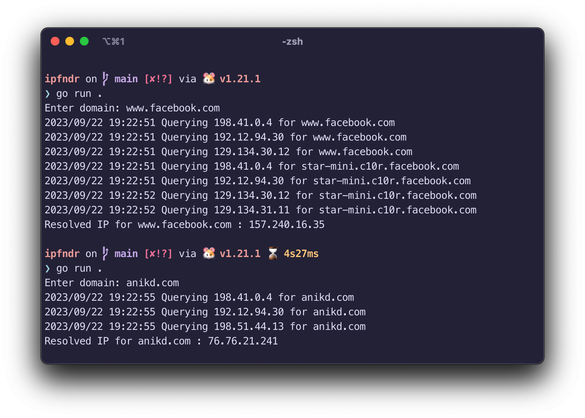

# ipfndr

simple implementation of dns resolving, following [Julia Evan's tutorial](https://implement-dns.wizardzines.com/index.html)

given a domain, finds the IP address of the domain using dns resolution. the dns resolution is written from scratch, and is slightly hacky.

starting at a root server, it does recursive dns resolving, till an IP address is resolved.



# using

```bash
# clone this repo

go run .

# enter name

```

## todo (sometime™, contribs welcome)

### general

- [ ] Add support for other record types
- [ ] CLI with flags to query specific types
- [ ] Better (nonexistent) error handling

### [technical](https://implement-dns.wizardzines.com/book/exercises.html)

- [ ] the dns domain compression/decompression doesn't check for pointer loops
- [ ] caching? lmao
